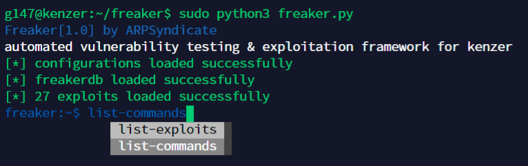
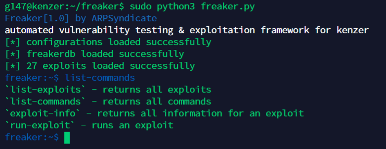
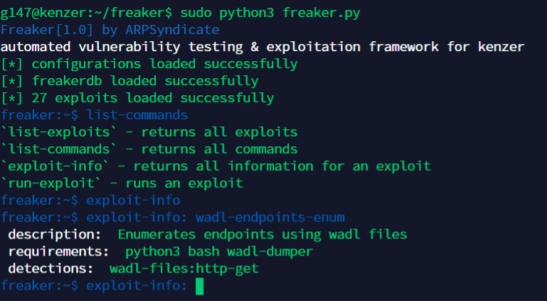

# Freaker | Automated Application Fingerprinting, Vulnerability Testing & Exploitation Framework for Kenzer

## Screenshots

## Instructions for running
1. Install requirements using `pip3 install -I -r requirements.txt`. 
2. FreakerDB can be cloned using `git clone http://github.com/ARPSyndicate/freakerdb`. 
3. Add all the configurations in `configs.yaml` 
4. Run `python3 freaker.py`. 

## Built-in Functionalities
>* `list-modules` - returns all modules
>* `list-commands` - returns all commands
>* `module-info` - returns all info about module
>* `run-module` - runs a module

**COMPATIBILITY TESTED ON ARCHLINUX(x64) & DEBIAN(x64) ONLY** 
**FEEL FREE TO SUBMIT PULL REQUESTS**